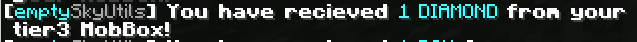

# emptySkyUtils [1.21 Paper / Spigot]

This plugin was made for the purpose of a skyblock server where you get rewarded for grinding mobs / farming. It was focused on configurability!

### EmptySkyUtils features:
- enchantShards (more than max level enchants)

- spawnerShards (give a reason to grind spawners (p.s: it's MORE SPAWNERS!) )

- mobBoxes (give a reason to grind spawners (this time it's not spawners, its items!) )

- More to Come Soon!

## Installation

The current installation method is a little scuffed (will be fixed in the future) but all previous and future plugin versions will be put in the plugin_jar folder.

```bash
Current version: 1.0
```

## Showcase

### EnchantShards


Current enchantShards:
- Looting
- Fortune
- Sharpness
- Smite
- Unbreaking
- Bane of Arthropods
- Protection
- Efficiency

### SpawnerShards


Current spawnerShards:
- Rabbit
- Chicken
- Cow
- Spider
- Zombie
- Skeleton

### MobBoxes




There are 8 types of MobBoxes by default, these are toggleable and fully configurable!

- Tier 1 (Common): Basic items like iron ingots, coal, and low-level tools and armor.
- Tier 2 (Uncommon): Slightly better items, including gold ingots, emeralds, and iron gear.
- Tier 3 (Elite): Higher chances of getting diamonds, enchanted items, and better equipment.
- Tier 4 (Rare): Valuable items like diamonds, enchanted books, and higher-tier armor.
- Tier 5 (Legendary): Rare and powerful items like netherite scrap, totems, and enchanted golden apples.
- Tier 6 (Mythic): Very rare items, including netherite ingots, elytra, and beacons.
- Resource Mob Box: Focused on resource blocks like coal, iron, redstone, lapis, and gold.
- Boss Mob Box: Contains unique and powerful items like the Nether Star, Wither Skeleton Skull, and Dragon Egg.
- 
## Commands
  ### /esu reload
  Description: Reloads the plugin configuration files.
  Permissions: emptyskyutils.admin
  Usage: /esu reload

 ### /esu giveshards <player> <amount> [type]
Description: Gives enchant shards to a player. If no type is specified, gives all shard types.
Permissions: emptyskyutils.admin
Arguments:

<player>: The name of the player to receive the shards.
<amount>: The number of shards to give.
[type]: The specific type of shard (optional).

 ### /esu giveboxes <player> <amount> [type]
Description: Gives MobBoxes to a player. If no type is specified, gives all box types.
Permissions: emptyskyutils.admin
Arguments:

<player>: The name of the player to receive the boxes.
<amount>: The number of boxes to give.
[type]: The specific type of box (optional).

## Configs

config.yml:
```bash
#config.yml
# true = feature enabled
# false = feature disabled
# 1.00 = 100% drop chance, 0.50 = 50% drop chance (a drop chance from 0.01-0.05 is recommended)
spawnerShards: true
enchantShards: true
sendEnchantMessage: false
sendSpawnerMessage: false
mobSpawnerShards:
  rabbit: true
  rabbitpercent: 0.60
  chicken: true
  chickenpercent: 0.50
  cow: true
  cowpercent: 0.40
  spider: true
  spiderpercent: 0.30
  zombie: true
  zombiepercent: 0.20
  skeleton: true
  skeletonpercent: 0.10
```

mobBoxes.yml:
```bash
# mobBoxes.yml
mobBoxes: true
sendMobBoxMessage: false
mobBoxDrops:
  tier1:
    enabled: true
    chance: 0.9
    entities: [RABBIT, CHICKEN, DROWNED]
  tier2:
    enabled: true
    chance: 0.1
    entities: [COW]
  tier3:
    enabled: true
    chance: 0.1
    entities: [SPIDER]
  tier4:
    enabled: true
    chance: 0.1
    entities: [ZOMBIE]
  tier5:
    enabled: true
    chance: 0.1
    entities: [SKELETON]
  tier6:
    enabled: true
    chance: 0.6
    entities: [ZOMBIFIED_PIGLIN]
  resource:
    enabled: true
    chance: 0.6
    entities: [MOOSHROOM]
  boss:
    enabled: true
    chance: 0.6
    entities: [WITHER]

mobBoxLootTable:
  tier1:
    items:
      item1: { material: IRON_INGOT, amount: 3, chance: 0.5 }
      item2: { material: COAL, amount: 5, chance: 0.7 }
      item3: { material: STONE_SWORD, amount: 1, chance: 0.4 }
```

## Contributing

Pull requests are welcome. For major changes, please open an issue first
to discuss what you would like to change.

Please make sure to update tests as appropriate.

## License

[MIT](https://choosealicense.com/licenses/mit/)
